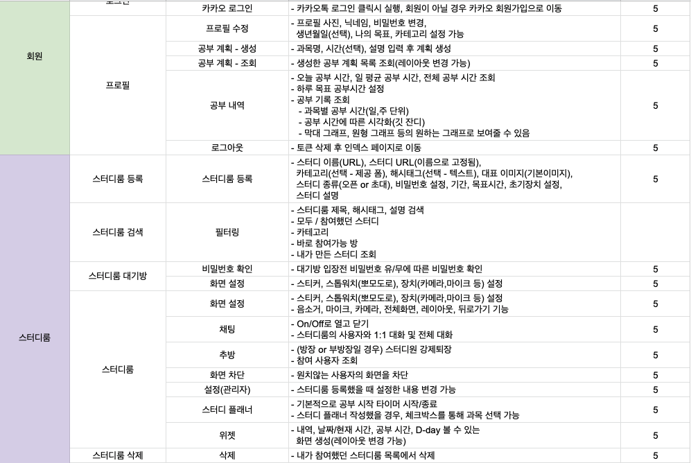
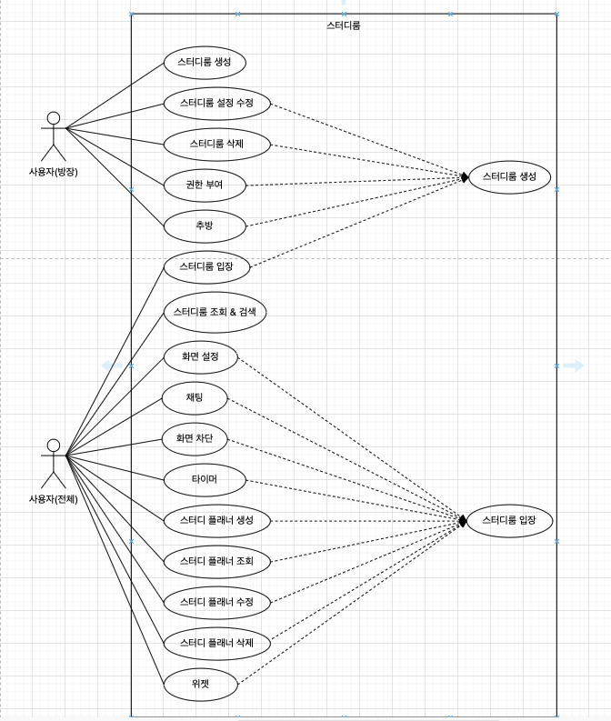
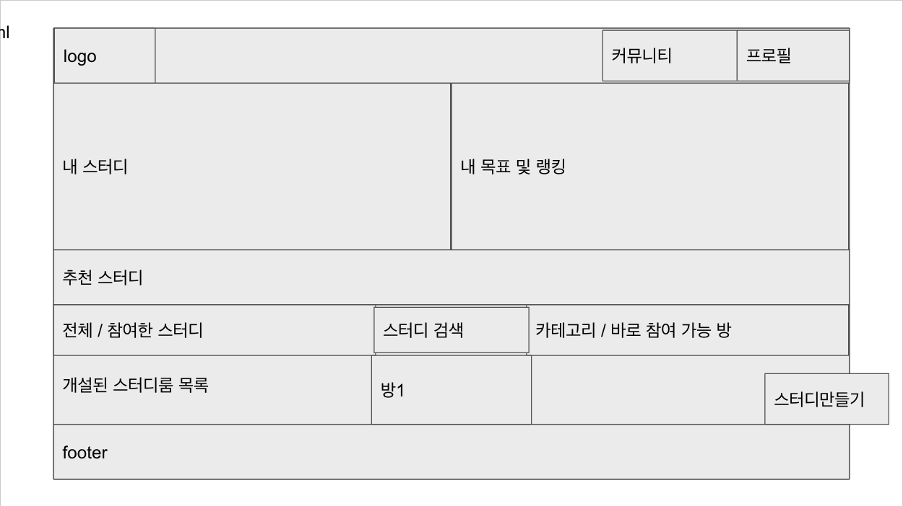
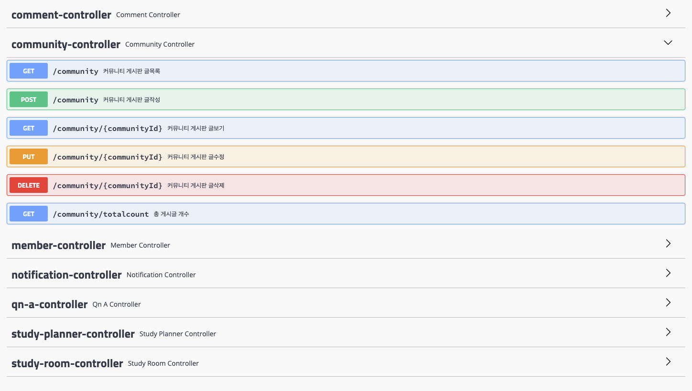
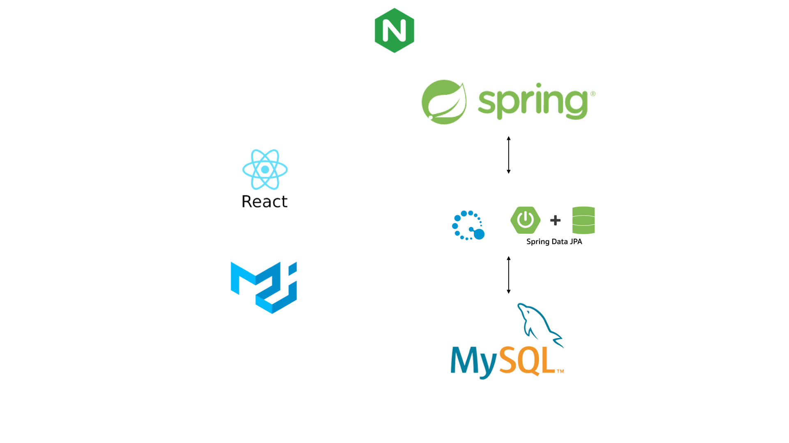
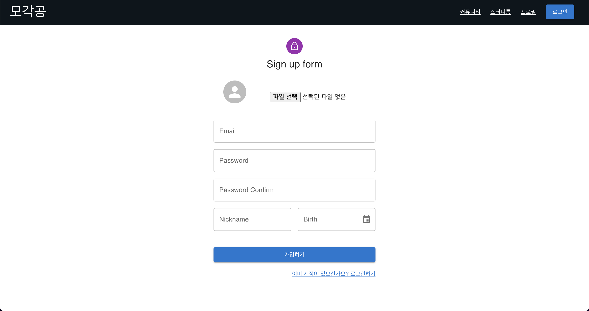
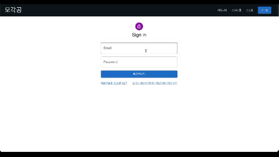
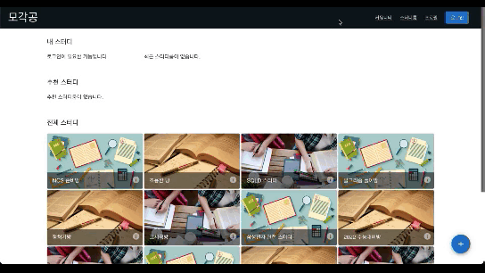
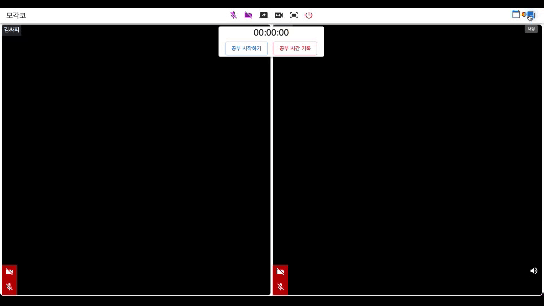

# ✏ 모각공

SSAFY 광주 2반 공통 프로젝트 4팀
📃 Notion : https://www.notion.so/12c9091a166744c49b5990a32f56fc78


[TOC]


### 프로젝트 소개

- **프로젝트 기간**
  2022.01.10 ~ 2022.02.18

- **기획 의도**

  코로나로 인해 비대면 수업이 증가하고 교육의 양상이 크게 변화하게 되었습니다.

  이에,

  1. 집에서 집중 환경을 만들기 어려운 학생들
  2. 카페, 독서실로 나가서 공부하기엔 코로나가 걱정되는 학생들
  3. 혼자 인강을 듣느라 소외감을 느끼는 학생들

  을 타겟으로 <u>코호트 러닝 효과</u>를 통해 스스로 학습 의지를 다잡을 수 있는 서비스를 제공하고자 합니다.

  > 코호트 러닝 효과?
  >
  > 공통적인 특성을 가진 사람들이 한데 모여 학습하는 것, 공부 효과와 정서적 안정이 극대화됨

- **기대 효과**
  1. 이동시간을 줄여 효율적인 공부!
  2. 비대면 서비스로 코로나 확산 방지
  3. 공부하는 시간에 따라 돈을 낼 필요가 없음
  4. 언제 어디서나 시간과 장소에 구애받지 않고 독립적인 공부 습관 형성 가능


### 팀원 소개


| 前 팀 장 | 팀 장  | 팀 원  | 팀 원  | 팀 원  |
| :------: | :----: | :----: | :----: | :----: |
|  김성현  | 김일환 | 심은조 | 정우철 | 하현서 |

#### 팀규칙


>------
>
>🤗**카메라 항상 켜기**🤗
>
>------
>
>😴**휴식시간 철저히😴** 자유 갈 때, 올 때 채팅 남기기
>
>------
>
>🐽**코어 타임 집중하기**🐽 10:00 - 12:00 오전 코어 타임 1:00 - 6:00 오후 코어 타임
>
>개별 작업을 하게 되면 시간을 정해서 상시 대기해서 언제든지 소통을 할 수 있도록!
>
>------
>
>🍒**일일 회고 남기기🍒**
>
>5시 30분 회의실에 모여서 다같이 회고하기 하루의 소감, 힘들었던 부분, 기술적인 부분 중에서 아무거나!
>
>------
>
>⚽**트러블 슈팅 남기기**⚽
>
>자세한 이슈 내용, 문제 원인, 시행착오 적어두기!
>
>------
>
>🥝**잠깨는 시간, 준비시간**🥝
>
>09:00- 09:05
>
>------
>
>🍍**잡담 시간**🍍 09:05 - 09:30
>
>- 한 주를 담당할 프로젝트 매니저(이하 PM)를 매주 선정
>- PM의 역할
> - PM은 팀원들이 그라운드 룰을 잘 지키는지 확인
> - 평일 아침 스크럼 및 회의 진행
>
>------
>
>🍎**스크럼 시간**🍎 09:30 - 10:00
>
>------
>
>🍏점심 시간🍏
>
>11:00 - 01:00
>
>- 사이에 알아서 1시간 갖기
>- 갈 때, 올 때 채팅 남기기
>
>------
>
>🍑**회고 시간**🍑
>
>05:30 - 6:00
>
>- 금요일
> - 한 주를 마무리하고 칭찬 / 아쉬운 점 공유 시간 갖기!
>
>------
>
>### GIt
>
>#### 규칙
>
>- **기능 단위**로 Push → Merge Request 생성
>
>- 팀원 모두 다른 사람이 작성한 코드 확인 후 Comment 작성 ‼본인 코드 뿐만 아니라 다른 사람 코드도 이해하기 ‼
>
>  
>
>#### Flow (Branch)
>
>- **master** : 제품으로 출시될 수 있는 브랜치
>
>- **dev** : 다음 출시 버전을 개발하는 브랜치
>
>- **feature** : 기능을 개발하는 브랜치
>
>- ex) 로그인 기능 위임 시
>
> feature/login 브랜치 생성
>
> ex) 같은 기능을 작업할 때 (로그인) → 이름의 이니셜 약어 이용하여 브랜치 생성
>
> feature/login/sh
>
> feature/login/hs
>
>
>
>#### Commit Message Convention
>
>- https://overcome-the-limits.tistory.com/entry/협업-협업을-위한-기본적인-git-커밋컨벤션-설정하기
>
>- **태그: 제목** 형태 → ex) Feat: 로그인 기능
>
> | 태그 이름 | 설명                                                     |
> | --------- | -------------------------------------------------------- |
> | Feat      | 새로운 기능 추가                                         |
> | Fix       | 버그 수정                                                |
> | Design    | CSS 등 사용자 UI 디자인 변경                             |
> | Comment   | 필요한 주석 추가 및 변경                                 |
> | Docs      | 문서를 수정한 경우                                       |
> | Rename    | 파일 혹은 폴더 명을 수정하거나 옮기는 작업만 수행한 경우 |
> | Remove    | 파일을 삭제하는 작업만 수행한 경우                       |
> | Recovery  | 파일 혹은 폴더를 복구하는 작업을 수행하는 경우           |
>
>
>
>#### 자주 사용하는 명령어
>
>- git push origin 브랜치명 → 원격 저장소로 해당 브랜치 push
>
> ex) git push origin login
>
>- git pull [원격저장소명] [원격저장소 브랜치명] → 원격 저장소에서 local로 pull
>
> ex) git pull origin feature → 원격 저장소에 있는 feature 브랜치 pull
>
>- git checkout -b 브랜치명 → 현재 있는 브랜치로부터 새로운 브랜치 생성(-b) 후 이동(checkout)
>
> ex) git checkout -b login → login 브랜치 생성 후 이동
>
>- 깃 저장소 이동하기
>
> ``` bash
> git clone --mirror {기존 레퍼지토리 주소}
> cd {기존 레퍼지토리 명}.git
> git remote set-url --push origin {신규 레퍼지토리 주소}
> git push --mirror
> ```
>
>
>
>- etc) git clone 옵션중 --mirror / --bare 차이점
>
> https://pinocc.tistory.com/138


### 프로젝트 명세

- 기능 명세서

  

  개발을 시작하기 전, 개발 목표를 정확하게 팀원들과 공유하기 위해 기능 명세서를 작성하였습니다.

  [기능 명세서 링크](https://docs.google.com/spreadsheets/d/18-CeEBBO8wSRqbJIzstc_J5Cyt1iNi4LRHm5akPiwvw/edit?usp=sharing)

- 유즈케이스

  

  시스템이 어떻게 사용되어야 할지 다이어그램으로 가시화하여 이해를 돕도록 했습니다.

  [유즈케이스 링크](https://app.diagrams.net/#G1sagDOmQBDiuSQeBHrKMscmzctqgiRLNo)

- 와이어프레임

  

  우리 서비스의 특징과 기능 등을 시작적으로 정확하게 정의하기 위해 와이어프레임을 제작하였습니다.

  [와이어프레임 링크](https://docs.google.com/presentation/d/1yVuQeDnOL--OQ7ABIADai3rTTZEwzWQRAwQoF91Pxrk/edit)

- API 명세서

  

  Frontend와 Backend 개발자간 소통을 원활하게 하기 위해 작성했습니다. (swagger 이용)

- 아키텍쳐

  

### 시연 영상

- ##### 회원가입

  이메일과 패스워드 입력 시 입력에 맞추어 즉시 피드백 가능




- ##### 로그인




- ##### 로그인 전 메인 페이지

  로그인하지 않아 '내 스터디'와 '추천 스터디'가 뜨지 않는 메인 페이지




- ##### 로그인 후 메인 페이지


- ##### 프로필 수정

  닉네임과 생일, 목표 및 관심사 설정 가능


- ##### 스터디룸 생성

  카테고리와 해시태그를 추가할 수 있음

  리뷰 페이지를 통해 입력을 잘못한 부분이 있는지 확인 가능


- ##### 스터디룸 입장


- ##### 채팅 기능




### 느낀점
